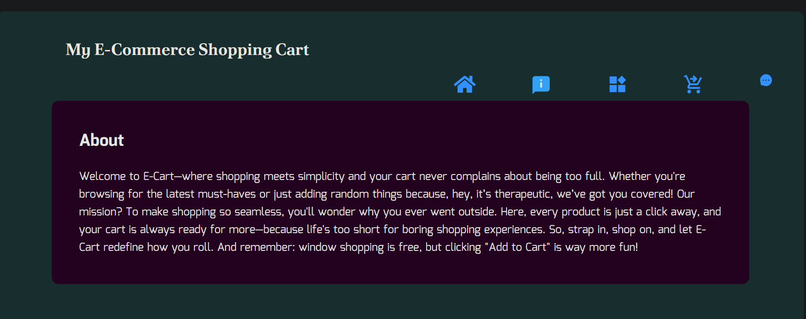
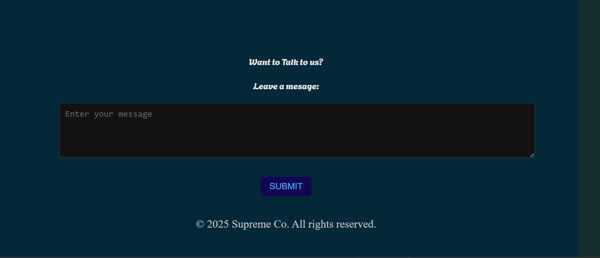

# My Simple E-cormmerce cart application
* The aim is to create a final product that allow users to browse products, add them to a cart, modify cart contents, and view a total price.

* With this i will be practicing essential React concepts such as components, props, state, events, and data management

## Learning Goals
1. Implement a mini web app to practice components, props, state, events, and data management in React.
2. Use a structured approach to build a fully functional application.
3. Enhance your understanding of data flow in React and interaction between components.

## Final Product

## It allows you as the user to: 
* See a list of available products with their names, prices, and an "Add to Cart" button.

* Add a product to the cart, increasing its quantity if it’s already in the cart.

* View a list of all items in the cart, including their names, prices, quantities, and the total price.

* Remove a product from the cart or adjust its quantity.

* Sort products by name or price (ascending/descending).

* Persist the cart state using localStorage.

* Display a message when the cart is empty or no products are available.

* Add search functionality to filter products by name.

### Next step 
I want to be able to add images to the product and have quntity working to be able to tell user whats remaining in store
